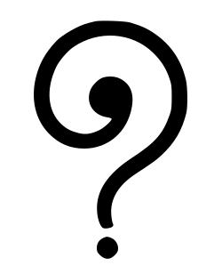
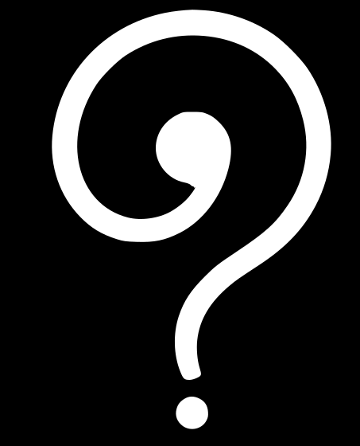
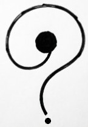
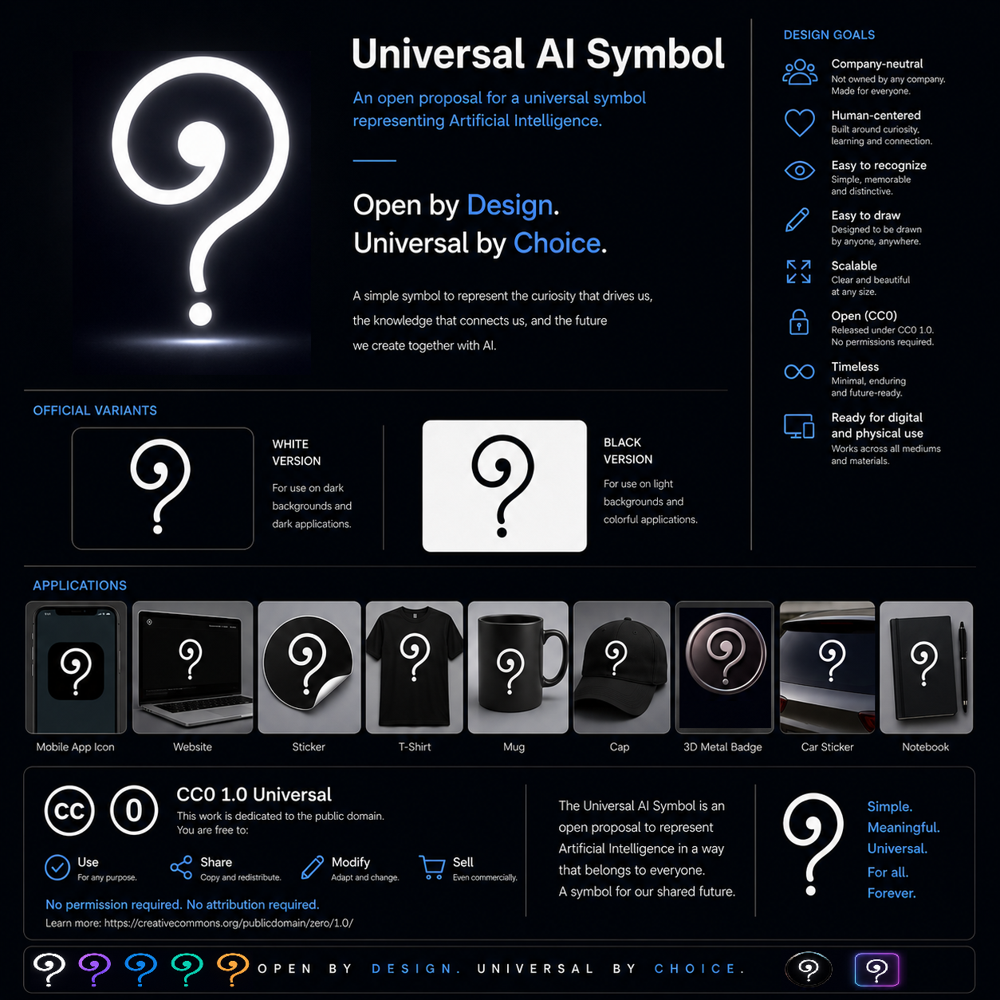

# Universal AI Symbol

<p align="center">
  
</p>

<p align="center">
  An open proposal for a universal symbol representing Artificial Intelligence.
</p>

---

# Introduction

The Universal AI Symbol project explores the creation of a simple, neutral, and open visual symbol that represents Artificial Intelligence independently of any company, product, technology, or implementation.

This repository contains the project's founding documents, design principles, historical proposals, visual specifications, and official resources.

The project is released openly so that individuals, educators, researchers, artists, developers, organizations, and communities may freely study, use, modify, reproduce, and distribute the symbol under the CC0 1.0 Universal dedication.

---

# Purpose

Throughout history, humanity has created symbols to communicate ideas that transcend language.

Artificial Intelligence has become one of the defining technologies of our time, yet there is still no widely recognized symbol representing AI as a general concept.

This project exists as an open proposal to explore that possibility.

The goal is not to declare an official global symbol.

The goal is to provide a freely available symbol that people may adopt voluntarily if they find it useful.

---

# Project Principles

The Universal AI Symbol project is guided by:

* Openness
* Neutrality
* Simplicity
* Accessibility
* Reproducibility
* Universality
* Voluntary adoption

The project does not seek ownership, exclusivity, or control over the symbol.

---

# Repository Structure

```
docs/

    Founding documents, principles, governance,
    and project information


specification/

    Visual specifications and usage guidelines


proposals/

    Historical proposals and evolution
    of the symbol


assets/

    Official visual resources


translations/

    Community translations
```

---

# Current Status

**Version:** 1.0

**Status:** Initial public release

The first public symbol proposal is documented as:

**UAS-001 — Universal AI Symbol First Symbol Proposal**

---

# Official Resources

## Symbol Variants

### Black Version


### White Version



---

# Contributing

The project welcomes:

* documentation improvements
* translations
* design discussions
* future proposals
* community feedback

Before contributing, please read:

* CONTRIBUTING.md
* CODE_OF_CONDUCT.md
* GOVERNANCE.md

---

# License

The Universal AI Symbol project is released under:

**Creative Commons CC0 1.0 Universal**

The symbol and related materials are dedicated to the public domain to the greatest extent permitted by law.

---

# Final Note

A symbol does not become universal because someone declares it universal.

Symbols become universal because people choose to use them.

This project provides an open possibility.

The future meaning of the symbol belongs to everyone.

---

# Project History

The Universal AI Symbol project preserves the evolution of the symbol from its original concept to the current public proposal.

## Original Hand Drawing




## Official Presentation Board

